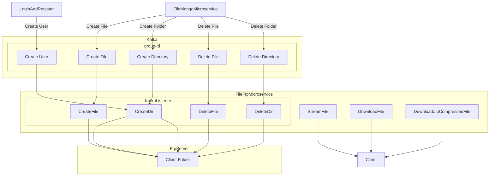

# FileFtpMicroservice
### Functions:

1. This microservice connects to an FTP server running on another host via MockFtpServer.
2. It uploads files to the FTP server when it receives messages from FileMongoMicroservice or LoginAndRegister.
3. It can remove files from the FTP server when the Kafka Listener receives messages from FileMongoMicroservice.
4. It can stream video and audio files from the FTP server.
5. It can download files from the FTP server.

### In the next version:

- Optimize compression of folders on the FTP server to zip format for download and add functionality to send the status of uploaded files.

Diagram of FileFtpMicroservice:

